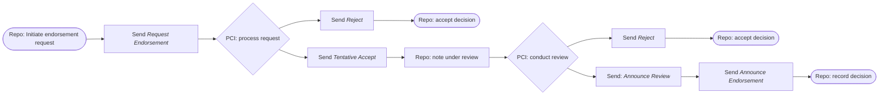

This workflow was originally developed between PCI and HAL, but it can be used by other repositories wishing to interoperate with PCI.

```mermaid
flowchart LR
    1(["`Repo: Initiate endorsement request`"])
    2["`Send *Request Endorsement*`"]
    3{"`PCI: process request`"}
    4["`Send *Reject*`"]
    5(["`Repo: accept decision`"])
    6["`Send *Tentative Accept*`"]
    7["`Repo: note under review`"]
    8{"`PCI: conduct review`"}
    9["`Send *Reject*`"]
    10(["`Repo: accept decision`"])
    11["`Send: *Announce Review*`"]
    12["`Send *Announce Endorsement*`"]
    13(["`Repo: record decision`"])
    
    1 --> 2
    2 --> 3
    3 --> 4
    4 --> 5
    3 --> 6
    6 --> 7
    7 --> 8
    8 --> 9
    9 --> 10
    8 --> 11
    11 --> 12
    12 --> 13
```

