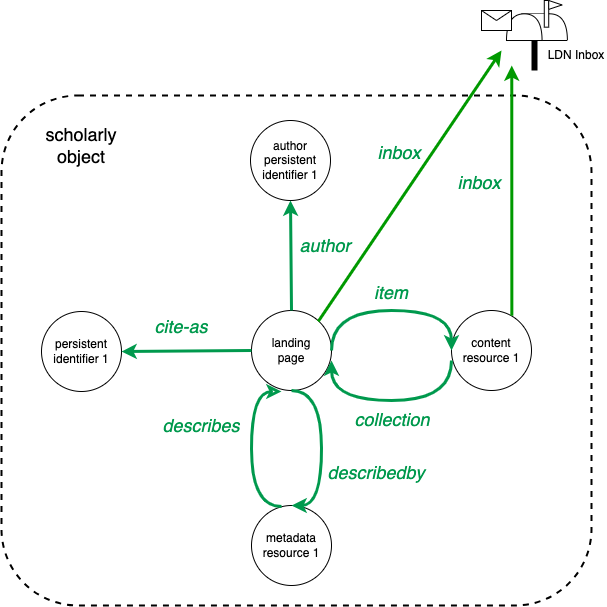

[FAIR Signposting](https://signposting.org/FAIR/) is the recommended mechanism to discover metadata about the _object of an activity_ in the COAR Notify protocol. All the messages in the COAR Notify protocol are lean, focussing on  _referencing_ online resources rather than embedding (meta)data inline. This communication style, referred to as "Passing by Reference" in the COAR Notify [specification](/specification/), leverages the distributed nature of repositories as the single source of truth, avoiding the need to transfer data into centralized silos. Signposting is a set of typed links that can be included on platforms to direct machines to information about the scholarly objects they host. This information includes pointers to landing pages, metadata, license details, author information, and related resources.

## Scholarly object

Scholarly objects are typically published on the web as a set of web resources, including a _landing page_ (which usually serves as the detailed view of an object, providing metadata, links to full text, and related resources), one or more _content resources_ (such as a PDF article, dataset, or presentation), and one or more _metadata resources_ (structured metadata in formats such as OAI-DC, DataCite, RIOXX). Scholarly objects can also be associated with identifiers and related resources, such as DOI, handle, author identifiers, licenses, and type classifications.

In the COAR Notify protocol, the main topic of the Request/Offer and Announcement patterns (`object.id`) points to the landing page of a scholarly object, with optional additional references to specific content resources associated with it (`object.ietf:item`). If a platform hosting scholarly outputs (e.g., data repositories, institutional repositories, publisher platforms) implements Signposting, machines can automatically discover the relationships between these objects, their metadata, and additional identifiers and resources.

Signposts are _typed links_ that point to resources and identifiers that constitute a scholarly object. Given the URL of a landing page, a Signpost can point to the associated content resources, metadata and identifiers. Given the URL of a content resource or a metadata resource, a Signpost can point to the landing page.

<p>
<br>
<em>Diagram of a scholarly object with a landing page, content resource, metadata resource and two identifiers. Signposting interrelates the different parts of the scholary object with typed links.</em>
</p>

## Typed links

Signposts are typed links that are added to resources that constitute a scholarly object. Two methods are available to provide such typed links:

1. Provide typed links as HTTP `Link` headers in a HTTP response.
2. Provide typed links as HTML `<link>` elements in a HTML response.

Method 1 is generally applicable for any type of Web resource. Method 2 is only applicable in case of HTML resources. COAR Notify does not recommend one method over the other. General guidelines for the two methods are briefly described below.

### General remarks

Each typed link contains at least two pieces of information:

- The URI reference of the _target_ resource or identifier a Signpost is pointing to;
- A _Link Relation Type_, that describes the relation type between the _origin_ resource that provide the type link and the _target_ resource.

For instance, when a platform uses Signposting to link the landing page to a metadata resource, the landing page serves as the _origin_, the metadata resource as the _target_, and the link relation type in this case is `describedby`.

Content and metadata resources require at least one extra piece of information:

- The media type of the resource (such as the MIME type);
- And, optionally, a profile to convey by means of a URI a specific format for the resource.

For instance, in case of a PDF content resource, the media type is `application/pdf`. In case of a metadata resource, the media type could be `text/xml`  and the profile could describe the namespace of the metadata format (e.g. `http://www.openarchives.org/OAI/2.0/oai_dc`).

### HTTP Link headers

HTTP Link headers are added to the header HTTP responses. They have the general form of:

```
Link: <target-url>; rel="relation-text" ; type="link-relation-type" ; profile="profile-url"
```

An example of such a HTTP Link header is:

```
Link: <https://repo.org/metadata/123.mods> ; rel="describedby" ; type="text/xml" ; profile="http://www.loc.gov/mods/v3"
```

When multiple Signpost links are available, HTTP Link headers can be repeated:

```
Link: <target-url-1>; rel="relation-text-1" ; type="link-relation-type-1" ; profile="profile-url-1"
Link: <target-url-2>; rel="relation-text-2" ; type="link-relation-type-2" ; profile="profile-url-2"
...
Link: <target-url-n>; rel="relation-text-n" ; type="link-relation-type-n" ; profile="profile-url-n"
```

Repeated HTTP Link headers may also be grouped in a comma separated list:

```
Link: <target-url-1>; rel="relation-text-1" ; type="link-relation-type-1" ; profile="profile-url-1",
      <target-url-2>; rel="relation-text-2" ; type="link-relation-type-2" ; profile="profile-url-2",
      <target-url-n>; rel="relation-text-n" ; type="link-relation-type-n" ; profile="profile-url-n"
```

### HTML &lt;link&gt; elements

HTML &lt;link&gt; elements are added to the header of HTML responses. They have the general form of:

```
<link href="target-url" rel="relation-text" type="link-relation-type" profile="profile-url"/>
```

An example of such a HTTP Link header is:

```
<link href="https://repo.org/metadata/123.mods" rel="describedby" type="text/xml" profile="http://www.loc.gov/mods/v3"/>
```

When multiple Signpost links are available, HTTP Link headers can be repeated:

```
<link href="target-url-1" rel="relation-text-1" type="link-relation-type-1" profile="profile-url-1"/>
<link href="target-url-2" rel="relation-text-2" type="link-relation-type-2" profile="profile-url-2"/>
...
<link href="target-url-n" rel="relation-text-n" type="link-relation-type-n" profile="profile-url-n"/>
```

### Serving very many Signposting typed links for one scholarly object

When a platform requires serving a very large number of typed links,  the Signposting specification provides the [Link Set](org/FAIR/#linksetrec) mechanism as a solution.

## Implementors guide

The following section provides an overview of implementation guidelines for platforms hosting scholarly outputs and for web agents that need to retrieve metadata for scholarly objects that are the subject of COAR Notification messages.

### Platforms

The COAR Notify guidelines for Signposting differentiate between the landing page, content resources, and metadata resources of a scholarly object. Guidelines for each type of resource are provided in the subsections below.

#### Landing page 

COAR Notify recommends for each landing page of a scholarly object to provide Signposting typed links to content resources, metadata resources, persistent identifiers, author identifiers and resource type indicators.

A table with the recommended typed links follows below:

| Target        | Link Relation Type | Cardinality | Comments | 
|---------------|--------------------|-------------|---------|
| Content resource | `item` | 0 or more | The `type` field is mandatory.|
| Metadata resource | `describedby` | 1 or more | The `type` is mandatory, see the [Signposting](https://signposting.org/FAIR/#level1) for an overview of common used types. For XML resources, COAR Notify recommends to use `profile` field to specify the URI of an XML namespace.|
| Persistent identifier | `cite-as` | 0 or 1 | The URL is the persistent identifier for the scholarly object, such as a DOI or a Handle. |
| Author identifier(s) |  `author` | 0 or more | For each author of the scholarly object provide a persistent identifier expressed as an URI. | 
| Resource type | `type` | 1 | The fixed URL value `https://schema.org/AboutPage`. | 
| Resource type | `type` | 1 | The URL is a [Schema.org](https://schema.org/CreativeWork#subtypes) CreativeWork that best describes the type of scholarly object.|

<br>

#### Content resources

COAR Notify recommends for each content resource a Signposting typed link to the landing page of the scholarly object and optionally a resource type indicator.

A table with the recommended typed links follows below:
  
| Target        | Link Relation Type | Cardinality | Comments | 
|---------------|--------------------|-------------|--------|
| Landing page  | `collection`       | 1  | The URL is the landing page associated with the content resource. | 
| Resource type | `type` | 0 or 1 | The URL is a [Schema.org](https://schema.org/CreativeWork#subtypes) CreativeWork that best describes the type of scholarly object.|

<br>

#### Metadata resources

COAR Notify recommends for each metadata resource a Signposting typed link to the landing page of the scholarly object.

A table with the recommended typed links follows below:
  
| Target        | Link Relation Type | Cardinality | Comments | 
|---------------|--------------------|-------------|--------|
| Landing page  | `describes`       | 1  | The URL is the landing page associated with the content resource. | 

<br>

#### Examples

The Signposting website provides an overview of adopters, which can be used as reference and example: [https://signposting.org/adopters/](https://signposting.org/adopters/).

### Web agents

For web agents that need to discover the metadata of the object of an COAR Notify activity, the following algorithm can be used:

1. Resolve the URL of the web resource with a HTTP HEAD request.
2. If a HTTP Link header with the relation `describedby` is available, then the URI reference of the `Link` header is the link to the metadata resource. End.
3. If a HTTP Link header with the relation `collection` is available, then continue with step 1 with the URL reference of the `Link` header.
4. If the HTTP `Content-Type` of the web resource is not `text/html`, then proceed to step 7.
5. Resolve the URL of the web resource with a HTTP GET request.
6. If a HTML `<link>` element with a `rel` attribute with value `describedby` is available, then the URL reference is the link to the metadata resource. End.
7. No information about metadata resources is available. End.

This algorithm can be hardened by verifying in step 2 and 6 that a relation type is available with the value `https://schema.org/AboutPage`.

## General remarks

- COAR Notify does not recommend a singular or minimal metadata format. However, many institutional repository platforms provide an [OAI-PMH](https://www.openarchives.org/pmh/) interface. As such, a Signposting `describedby` typed link to `verb=GetRecord` URL are feasible for such platforms. Such a typed link could at least provide OAI-DC with a type `text/xml` and profile `http://www.openarchives.org/OAI/2.0/oai_dc`.
- COAR Notify discourages the use of Signpost links that are dynamically generated by JavaScript in the browser, such as those on client-side dynamic web pages.
- Since Signposting requires machine interactions with scholarly platforms, COAR Notify discourages the use of content delivery network services, blocking robotic access, or requiring CAPTCHA tests to access the landing pages of scholarly objects. 
 
