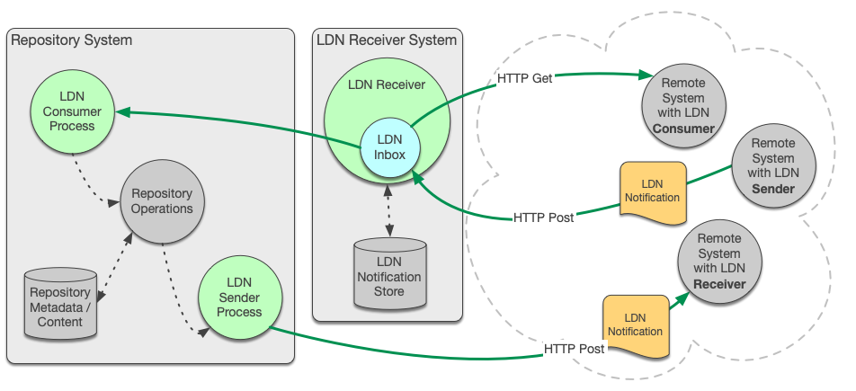

## W3C LDN

The overarching, logical architecture for COAR Notify is dictated by its reliance on the [W3C Linked Data Notifications (LDN)](https://www.w3.org/TR/2017/REC-ldn-20170502/) standard.

LDN is designed to work in an architecture of 3 logical components:

* **sender:** sends notifications to the _inbox_ of the _receiver_
* **receiver:** maintains the _inbox_ and receives notifications there
* **consumer:** fetches notifications from the _receiver_'s _inbox_

These components interact with each other via standard HTTP requests & responses.

## Deployment
However, to achieve point-point communications between, for example a repository and a review service, it may be expedient to combine `receiver` and `consumer` into  one logical component, to be embedded into the target system.

While this may be expedient, it does introduce a limitation, which  is that the receiver's inbox is not necessarily accessible via HTTP. For many (possibly most) Notify use-cases, this limitation will not be important.

Although there are probably other permutations, I suggest that the following broad deployment architectures are likely to be considered. In each case I have used a repository as the example system - but clearly any other type of relevant system could be substituted.

This key applied to the following diagrams:

### Option 1: Embedded and combined *Consumer* and *Receiver*

In this arrangement, the minimum development is done to allow the repository to both receive and send LDN notifications via HTTP. However, the *Inbox* is not exposed to HTTP Get requests for notifications received, because the combined *Consumer*/*Receiver* does not store the notifications at all. Instead, the *Consumer* processes the notifications as soon as they are received.

#### Advantages

* no reliance on external service (inbox provider)
* embedded and "in process" solution
* may be quicker, cheaper and easier to develop

#### Disadvantages

* both *Receiver* and *Inbox* components need to be developed
* no ability to fetch previous notifications
* tight coupling between repository and LDN Receiver creates potentially 'brittle' deployment - if the repository is offline, so is the *Receiver* and *Inbox*.
* no support for secondary consumers (e.g. aggregators, audit systems, backups, archiving etc.)
* may be difficult to scale to take advantage of more/disparate opportunities to interoperate with other LDN-enabled systems
* HTTP timeout calculations run the risk of including the time taken to consume the notification, which distorts the whole network-timeout aspect.

### Option 2: Embedded, but separate *Consumer* and *Receiver* with stored notifications

In this arrangement, a fully-functioning LDN *Receiver* and *Inbox* is embedded into the repository. The repository also embeds its own *Consumer*. In this example, the embedded consumer uses HTTP to fetch notifications from the Inbox, but it could perhaps use an "in process" method call of some kind.

#### Advantages

* notifications are persisted, allowing:
    * opportunity for more fault-tolerant behaviour
    * opportunity for repeated consumption of notifications by same or different services
* no reliance on external services (inbox provider)
* could support secondary consumers (e.g. aggregators, audit systems, backups, archiving etc.)

#### Disadvantages

* *Receiver* and *Inbox* components need to be developed
* tight coupling between repository and LDN Receiver creates potentially 'brittle' deployment - if the repository is offline, so is the *Receiver* and *Inbox*.

### Option 3: Independent Receiver

In this arrangement, the *Receiver* and *Inbox* are deployed as a separate service. This creates the opportunity to use an off-the-shelf LDN *Receiver* rather than needing to develop this functionality in the repository system.

#### Advantages

* notifications are persisted, allowing:
    * opportunity for more fault-tolerant behaviour
    * opportunity for repeated consumption of notifications by same or different services
* *Receiver* and *Inbox* components may not need to be developed
* loose coupling between repository and LDN Receiver allowing:
    * development, maintenance and deployment to be managed separately
    * could support secondary consumers (e.g. aggregators, audit systems, backups, archiving etc.)

#### Disadvantages

* Reliance on external service (although this may not be perceived to be a problem)
* More complex deployment and maintenance
* Potentially duplication of security logic and/or configurations (e.g. the *Receiver* must know which notifications to accept on behalf of the *Consumer*)
