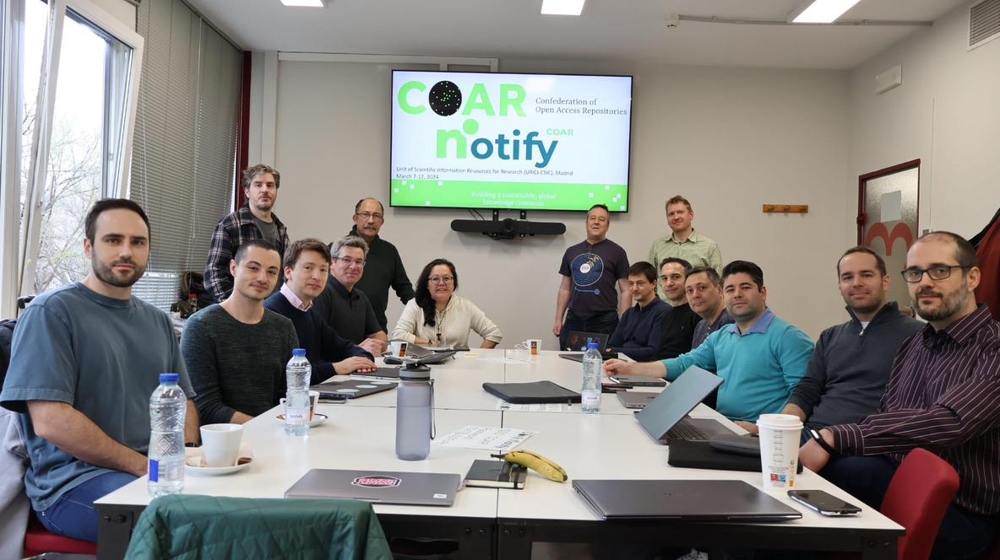

---
tags:
  - meetings
title: Notify Developers Meeting
date: 2024-03-14
draft: false
author: Paul Walk
---

On the 7th and 8th March 2024 a core group of developers came together to compare their experiences with implementing COAR Notify in their systems. We were generously hosted by Isabel Bernal of [CSIC](https://www.csic.es/es) in Madrid. In keeping with all COAR activities, a range of nationalities and domains was represented.

<!--more-->

We discussed a range of technical issues, comparing notes on what had worked well, and what needed improvement or clarification. It was also a chance for begin to establish a community of COAR Notify developers. Judging by the level of engagement, and the conversations over dinner, I think we were successful in this!

I will write here in more detail in future posts about some of the deeper technical issues, but in the meantime here is a summary of some of the decisions and outcomes:

1. Where  COAR Notify implementation software is directly commissioned by the Notify project we will use the [MIT license](https://opensource.org/license/mit) (a "permissive") license. However, we recognise that some platforms may require a different open-source license. We will not ordinarily work with software that is not open-source and licensed accordingly.
2. We will make one immediate change to the protocol ([documented in the change-log](/changelog/2024-03-21/))
3. After this immediate change to the protocol, we will use a more managed approach to versioning, deprecating etc. - however, we do not anticipate changing versions frequently.
4. We will develop an interim catalogue (on this website) to include the following:
   - Services implementing COAR Notify
   - Specific workflows supported by each service
   - Software platforms (e.g. repository platforms) which support each workflows
   - Open-source code-bases involved in implementing or supporting COAR Notify
5. Add more content to the Implementation Guide:
   - Document options for limiting access from remote systems, with some examples and the scenarios they address.
   - Extend the [architecture](/implementation/architecture/) section to include more options, and to add more detail to the pros, cons, affordances and consequences of each option.
   - Document the pros and cons of storing notifications versus not storing them
   - Document the recommended process for handling metadata with [signposting.org](https://signposting.org) - an end-to-end process
6. Increase communications support for the developer community:
   - Investigate using GitHub Discussions for forum
   - Create a mailing list to be used only for rare, important announcements (all the developers at the meeting agreed to be subscribed to this)
7. Define a new pattern for indicating that an activity was "un-processable”

The [interim catalogue](/catalogue/) is already available (**very much a "work-in-progress"**).

It was an excellent meeting - a really good group of developers doing important work. The COAR Notify team gained some invaluable insights into the challenges associated with implementing the COAR Notify protocol. I very much hope that we can do this again, perhaps in a year's time.

### Attendees

**Invited Developers:**
- Yannis Barlas, [Kotahi](https://kotahi.community/)
- Jose Carvalho, [University of Minho](https://www.uminho.pt/EN)
- Olivier Fambon, [Peer Community In (PCI)](https://peercommunityin.org/)
- Emilio Lorenzo, [Arvo](http://www.arvo.es/)
- Stefano Maffei, [4Science](https://www.4science.com/)
- Hrafn Malmquist, [Cottage Labs](https://cottagelabs.com/)
- Lautaro Matas, [La Referencia](https://www.lareferencia.info/en/)
- Will Fyson, [CoSector](https://www.cosector.com/)
- Adán Román, [Arvo](http://www.arvo.es/)
- Nicola Tarocco, [CERN](https://home.cern/)
- Raphaël Tournoy, [CCSD](https://www.ccsd.cnrs.fr/en/home/)
- Sean Wiseman, [eLife](https://elifesciences.org/)

**COAR Notify Team:**
- Martin Klein, [LANL](https://www.lanl.gov)
- Silvia Nakano, [COAR](https://www.coar-repositories.org)
- Paul Walk, [Antleaf](https://www.antleaf.com)
