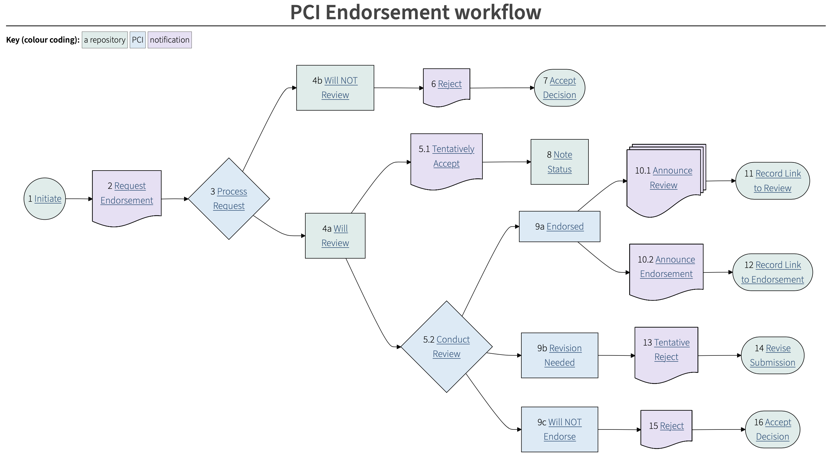

---
tags:
  - specification
title: Significant Revision to the Specification
date: 2024-10-16
draft: false
author: Paul Walk
---

The COAR Notify team is pleased to announce a significant revision to the COAR Notify Protocol specification, and the documentation (this website) in general.

This is in response to feedback from those developers who have been implementing the specification. Some of these changes were agreed at the [meeting for developers in Madrid](/2024/notify-developers-meeting-2024/), back in March of this year. Other feedback has been provided in GitHub [issues](https://github.com/orgs/coar-notify/projects/1) and [discussions](https://github.com/coar-notify/coar-notify.net/discussions/33)

<!--more-->

In particular I'd like to thank Patrick Hochstenbach, Olivier Fambon, Richard Jones and Stefano Maffei for their help with preparing this revised documentation.

### Changed approach to documenting the specification
We have re-introduced the IETF's [RFC2119](https://www.ietf.org/rfc/rfc2119.txt) language ("MUST", "SHOULD" etc.) in order to make the specification clearer. This has not necessarily made the specification stricter, but it has made it more precise.

### Introduction of version control
One of the most important new features is that the specification is now under version control, using [semantic versioning](https://semver.org). In the Madrid meeting, we agreed that we would create a notional pre-version 1 specification, because there has been a certain amount of development while the specification was evolving. This means that we now have two published versions:

- version [0.9.0](/specification/0.9.0/) which is a "legacy" version
- version [1.0.0](/specification/1.0.0/) which is now the **current** version.

Due to the nature of the changes, and of JSON-LD in general, systems which have implemented patterns in the 0.9.0 version should have little difficulty in converting to the 1.0.0 version. In the majority of cases, notifications in the older version should still be processable in any case.

### Specification changes (version 1.0.0)
The syntactic changes to the patterns in version 1.0.0 are itemised in the [release notes](/specification/1.0.0/release-notes/) for this version.

### New domain for this documentation, for the JSON-LD context and the vocabulary terms
For some time we have been reconsidering the need for PURLs (or any other so-called "PID" system for the JSON-LD context and for the vocabulary terms). In the last few days, the PURL system has been offline due to a DOS attack against the Internet Archive. This has accelerated our decision to deprecate our use of PURLs. The PURLs which we have minted for use in the `@context` property and in the vocabulary terms will continue to work, but we will no longer be minting new PURLs. This is made clear in [version 1.0.0](/specification/1.0.0/) of the specification, and in the vocabulary terms documentation - e.g. [_EndorsementAction_](/specification/vocabulary/EndorsementAction/).

### New approach to documenting workflows
Workflows are no longer documented with the "swim lanes" diagram approach. Instead, a flowchart is automatically generated from the workflow documentation and presented using [Mermaid](https://mermaid.js.org). This is an example from the [PCI Endorement workflow](/catalogue/workflows/repository-pci/):

### Feedback
As ever, please report any issues with the specification or the documentation in the [GitHub issues](https://github.com/coar-notify/coar-notify.net/issues) for this website.

